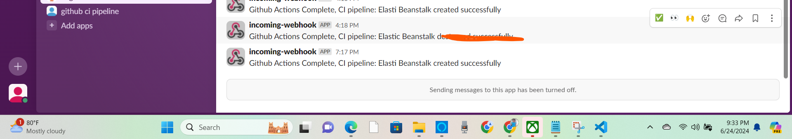
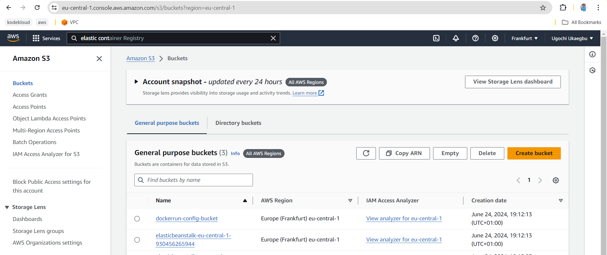
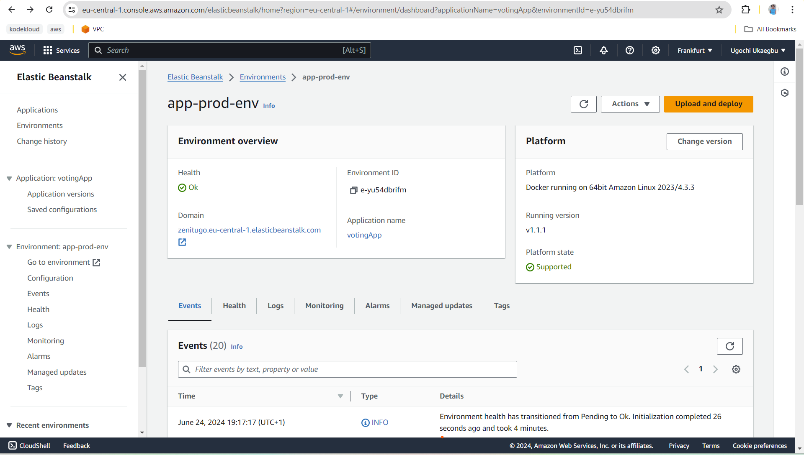
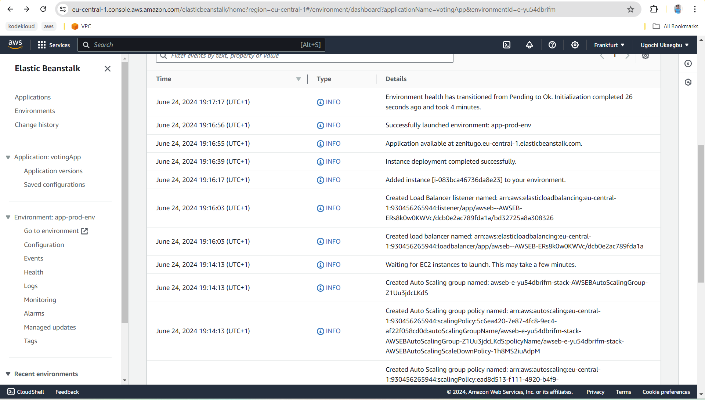

# DEPLOYMENT OF A DJANGO APPLICATION ON AWS ELASTIC BEANSTALK
This project was done to improve my knowledge in utilising AWS offering to deploy applications.
The source code for the python application can be found [here](https://github.com/SuryaPratap2542/Voting-Site)

**To see how to deploy django app on AWS Elastic Beanstalk using AWS CLI read this article I wrote on**
[Hashnode](https://dhebbydavid.hashnode.dev/deployment-of-a-django-application-on-aws-elasticbeanstalk-using-aws-cli)

## PRE-REQUISITE
The article has higlighted the pre-requisites to have, the only difference here is that `Terraform` was installed as this repository talks about using terraform to create Beanstalk infrastructure and the necessay resources required by Beanstalk such EC2 and S3 buckets

## DEPLOYMENT ARCHITECTURE

.png)

## GITHUB ACTIONS
The GitHub Actions workflow file `main.yml` is used to automate the deployment of the terraform scripts. 

It was also configured to send alerts on slack when the deployment has been completed.

## Terraform
Terraform tool was used to provision the docker image build and push to Amazon Elastic Container Registry.

It
 was used to create S3 bucket, ec2 instance profile and the elastic beanstalk environment

The S3 buckets were created to store the **Dockerrun.aws.json.zip** file and the **.ebextensions** directory

 **Proof of s3 bucket creation**
 

 **Proof of ec2 instance created**
 

 Different resource block was used to create the Elastic Beanstalk application and environment.

 **Proof of beanstalk application created**
 
 

 ## PROOF OF DEPLOYMENT OF DJANGO APP
 

